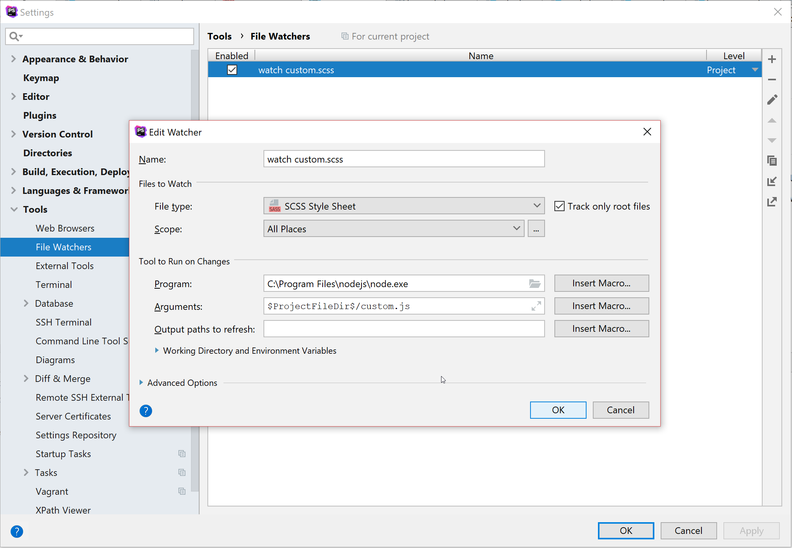

# Bootstrap CI Tester
> Test custom colors on [some Boostrap 4 example templates](https://getbootstrap.com/docs/4.1/examples/)

## Run
``npm run start`` to start the web server.

## Customize colors

Define custom bootstrap colors in [custom.scss](./custom.scss) and run ``npm run preprocess`` to bake in the styles.

## Run a watcher
Run [custom.js](./custom.js) in a background node process to watch custom.scss for file changes and preprocess the CSS files automatically 

E.g. Jetbrains PhpStorm:

## Disclaimer
This project is using the source code of some example Bootstrap 4 templates from https://getbootstrap.com/docs/4.1/examples/